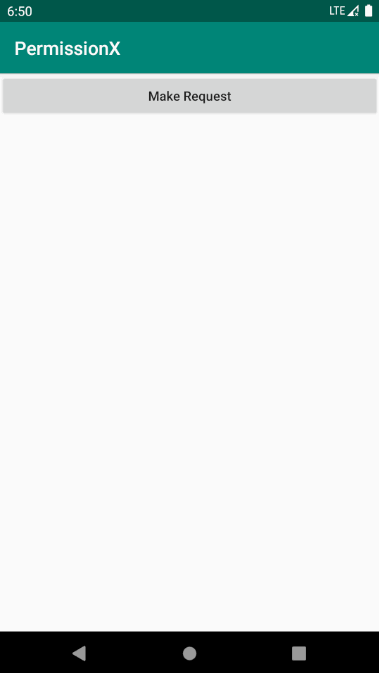
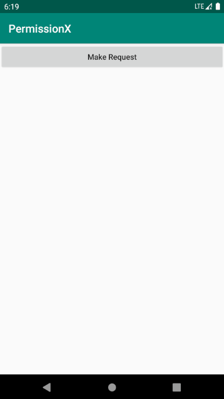
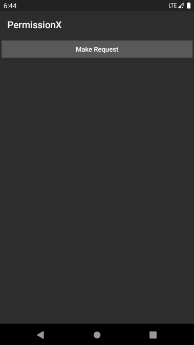

# PermissionX

[英文文档](README.md)

PermissionX是一个扩展的Android库，它使Android运行时权限请求变得极其容易。您可以将其用于基本权限请求场合或处理更复杂的情况，例如显示基本原理对话框或手动转到应用程序设置以获取权限。

## 快速设置

编辑build.gradle文件并添加以下依赖项。

```groovy
repositories {
  google()
  mavenCentral()
}

dependencies {
    implementation 'com.guolindev.permissionx:permissionx:1.8.1'
}
```

这就是全部。现在你准备好了。

## 基本用法

使用PermissionX请求Android运行时权限非常简单。

例如。如果你想请求READ_CONACTS、CAMERA和CALL_PHONE权限，请先在AndroidManifest.xml中声明它们。

```xml
<manifest xmlns:android="http://schemas.android.com/apk/res/android"
    package="com.permissionx.app">

	<uses-permission android:name="android.permission.READ_CONTACTS" />
	<uses-permission android:name="android.permission.CAMERA" />
	<uses-permission android:name="android.permission.CALL_PHONE" />

</manifest>
```

然后，您可以使用以下代码进行请求。

```kotlin
PermissionX.init(activity)
    .permissions(Manifest.permission.READ_CONTACTS, Manifest.permission.CAMERA, Manifest.permission.CALL_PHONE)
    .request { allGranted, grantedList, deniedList ->
        if (allGranted) {
            Toast.makeText(this, "All permissions are granted", Toast.LENGTH_LONG).show()
        } else {
            Toast.makeText(this, "These permissions are denied: $deniedList", Toast.LENGTH_LONG).show()
        }
    }
```

将FragmentActivity或Fragment的任何实例传递到**init**方法中，并在**permissions**方法中指定要请求的权限，然后调用**request**方法进行实际请求。

请求结果将在请求lambda中回调**allGranted**表示您请求的所有权限是否都由用户授予，可能为true或false，**grantedList**保存所有已授予的权限，**deniedList**保存所有被拒绝的权限。



现在，您可以在请求lambda中编写自己的逻辑来处理应用程序的特定情况。

## 更多用法

如您所知，Android提供了**shouldShowRequestPermission基本原理**方法，以指示我们是否应该显示一个基本原理对话框，向用户解释我们为什么需要此权限。否则，用户可能会拒绝我们请求的权限，并勾选**永不再问**选项。

为了简化此过程，PermissionX提供了**onExplainRequenceReason**方法。将此方法链接到**request**方法之前，如果用户拒绝其中一个权限，**onExplainRequence**方法将首先得到回调。然后，您可以调用**showRequestReasonDialog**方法，向用户解释为什么需要这些权限，如下所示。

```kotlin
PermissionX.init(activity)
    .permissions(Manifest.permission.READ_CONTACTS, Manifest.permission.CAMERA, Manifest.permission.CALL_PHONE)
    .onExplainRequestReason { scope, deniedList ->
        scope.showRequestReasonDialog(deniedList, "Core fundamental are based on these permissions", "OK", "Cancel")
    }
    .request { allGranted, grantedList, deniedList ->
        if (allGranted) {
            Toast.makeText(this, "All permissions are granted", Toast.LENGTH_LONG).show()
        } else {
            Toast.makeText(this, "These permissions are denied: $deniedList", Toast.LENGTH_LONG).show()
        }
    }
```

**showRequestReasonDialog**方法将提示一个基本原理对话框，其中包含第二个参数提供的信息。若用户单击显示文本作为第三个参数提供的肯定按钮，PermissionX将再次请求第一个参数提供权限。

第四个参数作为否定按钮的文本是可选的。如果拒绝的权限是必要的，您可以忽略第四个参数，对话框将无法取消。这意味着用户必须允许这些权限才能进一步使用。


当然，用户仍然可以拒绝某些权限，并选中**永不再问**选项。在这种情况下，每次我们再次请求这些权限时，都会被自动拒绝。我们唯一能做的就是提示用户，他们需要在应用程序设置中手动允许这些权限以继续使用。但PermissionX做得更好。

PermissionX提供了**onForwardToSettings**方法来处理此情况。将此方法链接到**request**方法之前，如果某些权限被用户“拒绝且不再询问”，则**onForwardToSettings**方法将获得回调。然后，您可以调用**showForwardToSettingsDialog**方法，如下所示。

```kotlin
PermissionX.init(activity)
    .permissions(Manifest.permission.READ_CONTACTS, Manifest.permission.CAMERA, Manifest.permission.CALL_PHONE)
    .onExplainRequestReason { scope, deniedList ->
        scope.showRequestReasonDialog(deniedList, "Core fundamental are based on these permissions", "OK", "Cancel")
    }
    .onForwardToSettings { scope, deniedList ->
        scope.showForwardToSettingsDialog(deniedList, "You need to allow necessary permissions in Settings manually", "OK", "Cancel")
    }
    .request { allGranted, grantedList, deniedList ->
        if (allGranted) {
            Toast.makeText(this, "All permissions are granted", Toast.LENGTH_LONG).show()
        } else {
            Toast.makeText(this, "These permissions are denied: $deniedList", Toast.LENGTH_LONG).show()
        }
    }
```

**onForwardToSettings**方法中的参数与**showRequestReasonDialog**方法相似。当用户点击肯定按钮时，PermissionX将转发到您的应用程序的设置页面，用户可以非常快速地打开必要的权限。当用户切换回应用程序时，PermissionX将自动再次请求必要的权限。



## 请求前解释

在实际请求权限之前，显示基本原理对话框并向用户解释为什么需要这些权限总是一种很好的方式。

使用PermissionX执行此操作非常简单。只需使用**explainReasonBeforeRequest**方法，如下所示。

```kotlin
PermissionX.init(activity)
    .permissions(Manifest.permission.READ_CONTACTS, Manifest.permission.CAMERA, Manifest.permission.CALL_PHONE)
    .explainReasonBeforeRequest()
    ...
```

现在一切都很有魅力。


## 深色主题

PermissionsX提供的基本原理对话框自动支持Android黑暗主题。如果你把设备换成深色主题，一切都会很好。



## 许可证

```
Copyright (C) guolin, PermissionX Open Source Project

Licensed under the Apache License, Version 2.0 (the "License");
you may not use this file except in compliance with the License.
You may obtain a copy of the License at

     http://www.apache.org/licenses/LICENSE-2.0

Unless required by applicable law or agreed to in writing, software
distributed under the License is distributed on an "AS IS" BASIS,
WITHOUT WARRANTIES OR CONDITIONS OF ANY KIND, either express or implied.
See the License for the specific language governing permissions and
limitations under the License.
```
